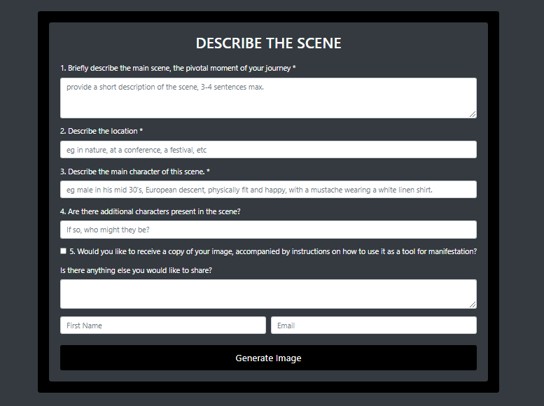

# AI Image Generator



## Overview

The AI Image Generator is a robust Node.js application utilizing the Express.js framework. This application leverages OpenAI's DALL-E 3 model to generate images based on user inputs, creating a seamless and interactive experience.

## Key Features

- **Image Generation**: Utilizes the DALL-E 3 model to generate images from textual descriptions.
- **User Input Handling**: Accepts and processes user inputs to create customized image prompts.
- **API Integration**: Seamlessly integrates with OpenAI's API for advanced image generation capabilities.
- **Data Persistence**: Stores user details in a CSV file for record-keeping and analytics.

## Technologies Used

- Node.js
- Express.js
- Multer
- OpenAI's DALL-E 3
- Dotenv for environment management

## Installation and Setup

Ensure you have Node.js and Visual Studio Code installed on your machine. If not, follow these instructions:

1. **Node.js Installation**: Download and install Node.js from [here](https://nodejs.org/en/download/).
2. **VS Code Installation**: Download and install Visual Studio Code from [here](https://code.visualstudio.com/download).

Once the installations are complete, proceed with the following steps:

1. Clone the Repository:

   ```bash
   git clone https://github.com/RaheesAhmed/ai-image-generator.git

   ```

1. Clone the repository: `git clone https://github.com/RaheesAhmed/ai-image-generator.git`

1. Install dependencies: Run `npm install` in the project directory.

1. Create a `.env` file in the project directory and add your OpenAI API key:

   ```plaintext
   OPENAI_API_KEY=your-api-key
   ```

1. Start the server: Run `npm start` in the project directory.

1. Access the app: Open your web browser and go to [http://localhost:3000/](http://localhost:3000/).

## Customization

To customize the prompt used in the application, follow the steps below:

1. Open the `index.js` file in your project directory.

2. Find the following line of code:

   ```javascript
   app.post("/generate-images", upload.none(), async (req, res) => {
     const prompt = `Create a cinematic still in 32k resolution and landscape format depicting ${mainScene}, located at ${location}. The main character is ${mainCharacter}. Additional characters include ${additionalCharacters}. ${additionalInfo}`;
   });
   ```

3. Modify the `prompt` variable as needed.

## Developed By

Rahees Ahmed
